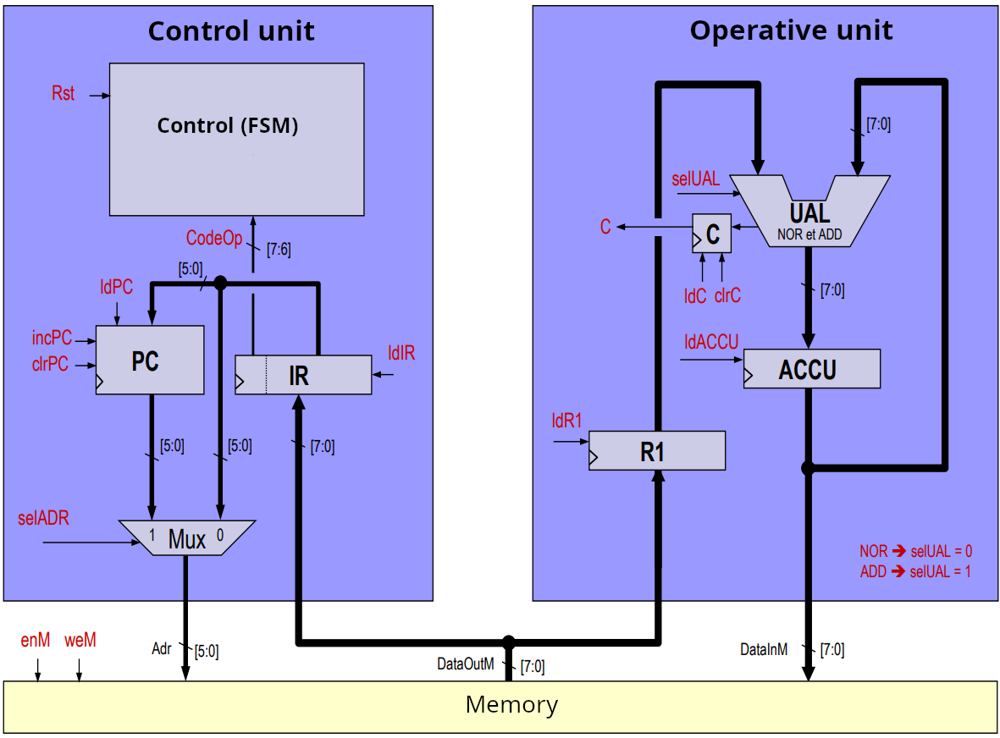
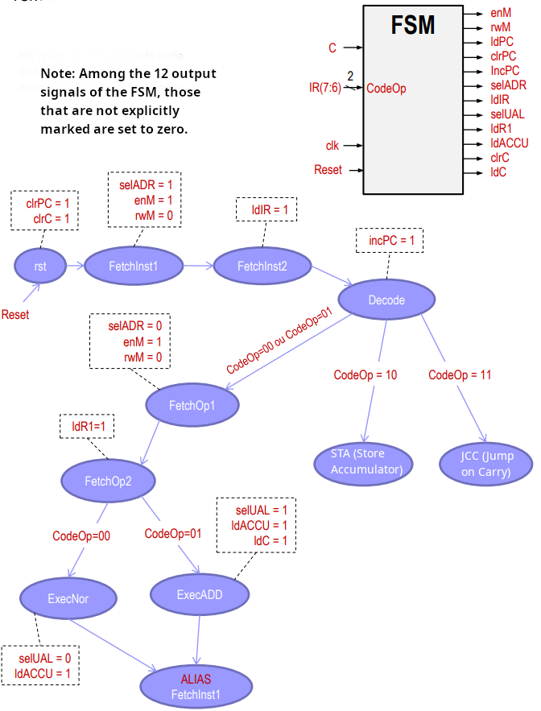
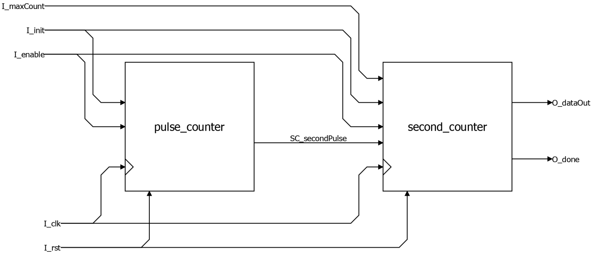

# VHDL Code Portfolio - Etienne Bertin

Welcome to my VHDL portfolio. This repository contains a selection of synthesizable VHDL modules from my academic projects at IMT Atlantique, submitted as part of my internship application to Veoware.

These three modules demonstrate my hands-on experience in RTL design, covering the fundamental pillars of FPGA development:
1.  **Architectural Control** (`Ctrl_unit.vhd`)
2.  **Finite State Machine (FSM) Design** (`fsmMoore.vhd`)
3.  **Datapath & Timing Management** (`counter.vhd`)

---

## Project 1: 8-bit General Purpose CPU

**Context:** This project involved designing a simple 8-bit Von Neumann CPU from the ground up, capable of executing a 4-instruction set.

### Module: `Ctrl_unit.vhd`

* **File Role:** This module is the **main Control Unit** of the processor. It serves as the "brain," managing the 'Fetch' and 'Decode' stages of the instruction cycle.
* **Design & Key Skills:**
    * **Architectural Design:** This unit was designed structurally to manage the core components of the control path (see architecture diagram below).
    * **Program Counter (PC):** Implements the 6-bit PC logic, including synchronous reset, increment (`incPC`), and jump (`ldPC`) capabilities.
    * **Instruction Register (IR):** Implements the logic to latch instruction data from memory (`DataIn`). It parses the 8-bit instruction, splitting it into the 2-bit operation code (`CodeOp`) and the 6-bit address/operand (`O_IR`).
    * **Address Multiplexing:** Manages the address bus (`AdrOut`) by selecting whether the memory address comes from the PC (for fetching) or the IR (for data access).
    * **FSM Integration:** This module instantiates and provides the necessary inputs/outputs for the core Finite State Machine (`FSMCTRL`), which orchestrates the complete execution flow.

**Supporting Architecture:**

---

## Project 2: Crossroads Traffic Light Controller

**Context:** This project involved designing a complete traffic light controller. The system manages traffic flow between a main road and a secondary path based on vehicle presence sensors (`I_presence`) and multiple safety timers (`I_timerDone`). The design is split into a Control Unit (FSM) and an Operative Unit (Counter Datapath).

### Module: `fsmMoore.vhd`

* **File Role:** This module is the **Control Unit** for the traffic light system. It is a pure 14-state Moore Finite State Machine (FSM) that dictates the sequence of lights.
* **Design & Key Skills:**
    * **Robust FSM Design:** Implemented using the industry-standard 3-process methodology (State Register, Next-State Logic, Output Logic), which ensures predictable synthesis and simplifies debugging.
    * **Complex State Transitions:** The FSM correctly handles transitions based on a combination of inputs, such as waiting for a timer to finish (`I_timerDone = '1'`) or detecting a car (`I_presence = '1'`).
    * **Control Signal Generation:** The output logic process clearly defines the control signals (`O_led`, `O_maxCount`, `O_initTimer`, `O_enableTimer`) for each of the 14 states, ensuring the datapath is correctly driven.

**FSM State Diagram:**

### Module: `counter.vhd`

* **File Role:** This module is the **Datapath (Operative Unit)** of the controller, responsible for all timing operations.
* **Design & Key Skills:**
    * **Multi-Scale Timing:** This is not a simple counter. It skillfully handles multiple time scales by implementing two separate counters:
        1.  A wide pre-scaler (`pulse_counter`) that counts 100 million clock cycles (from a 100MHz clock) to generate a single, one-clock-cycle "second pulse" (`SC_secondPulse`).
        2.  A smaller `second_counter` that decrements from a given value (`I_maxCount`) only when it receives the `SC_secondPulse`.
    * **Parametrization:** The design uses a `GENERIC` (`G_number_of_cycle_per_second`) to define the clock frequency. This makes the component highly reusable and easy to simulate (by setting the generic to a small value) or synthesize for the real hardware.
    * **Clear Interface:** Provides a clear "done" signal (`O_done`) for the FSM and outputs the current countdown value (`O_dataOut`) for the 7-segment display.

**Datapath Architecture:**
